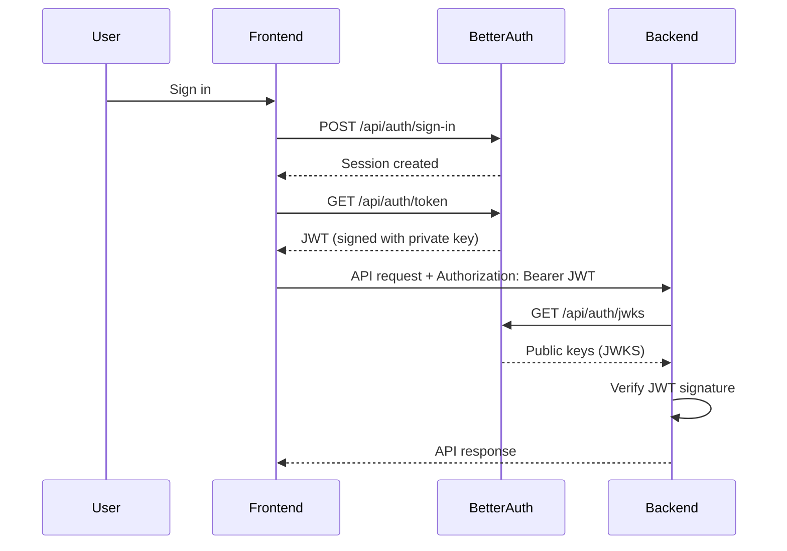

Auth UI Boilerplate uses a modern, secure JWT/JWKS authentication approach that eliminates the need for shared secrets between your frontend and backend services.

## How It Works

The authentication flow follows these steps:

<Steps>
  <Step title="User Authentication">
    Users sign in via email/password or OAuth (Google) through Better Auth. Better Auth manages the session securely.
  </Step>
  
  <Step title="JWT Token Issuance">
    When your frontend needs to call your backend API, it requests a JWT from Better Auth via the `/api/auth/token` endpoint. The JWT is signed with the server's private key (Ed25519 by default).
  </Step>
  
  <Step title="Token Transmission">
    The frontend includes the JWT in the `Authorization: Bearer <token>` header when making API requests to your backend.
  </Step>
  
  <Step title="Token Verification">
    Your backend verifies the JWT signature by fetching the public keys from Better Auth's JWKS endpoint at `/api/auth/jwks`. No shared secrets needed.
  </Step>
</Steps>

## Why JWKS?

JWKS (JSON Web Key Set) provides several advantages over traditional shared secret approaches:

<CardGroup cols={2}>
  <Card title="No Shared Secrets" icon="shield">
    Your backend never needs to know the private signing key. It only uses public keys to verify signatures.
  </Card>
  
  <Card title="Key Rotation" icon="rotate">
    Better Auth can rotate signing keys without requiring backend redeployment. New keys are automatically discovered via the JWKS endpoint.
  </Card>
  
  <Card title="Multiple Backends" icon="server">
    Multiple backend services can all verify tokens using the same JWKS endpoint without sharing credentials.
  </Card>
  
  <Card title="Industry Standard" icon="check">
    JWKS is a widely adopted standard (RFC 7517) with robust library support across all major programming languages.
  </Card>
</CardGroup>

## Authentication Flow Diagram



## Token Structure

Better Auth issues JWTs with the following standard claims:

| Claim | Description | Example |
|-------|-------------|--------|
| `sub` | User ID (subject) | `"abc123def456"` |
| `iss` | Issuer (Better Auth URL) | `"http://localhost:3000"` |
| `aud` | Audience (Better Auth URL) | `"http://localhost:3000"` |
| `exp` | Expiration timestamp | `1234567890` |
| `iat` | Issued at timestamp | `1234567800` |
| `email` | User's email address | `"user@example.com"` |
| `name` | User's display name | `"John Doe"` |

<Note>
JWTs are short-lived by default (typically 1 hour). The frontend automatically refreshes tokens when they're close to expiration (within 10 seconds).
</Note>

## API Client Integration

The boilerplate includes two ready-to-use API clients with automatic JWT injection:

<CodeGroup>
```typescript api-client.ts (Fetch-based)
import apiClient from "@/lib/api-client"

// JWT is automatically included in the Authorization header
const response = await apiClient.verifyAuth()
```

```typescript api-client-axios.ts (Axios-based)
import apiClient from "@/lib/api-client-axios"

// JWT is automatically included in the Authorization header
const response = await apiClient.get("/api/users/me")
```
</CodeGroup>

Both clients:
- Cache JWTs and refresh them automatically when close to expiration
- Add a 10-second buffer to prevent using tokens about to expire
- Include the token in the `Authorization: Bearer <token>` header
- Handle token errors gracefully

## Backend Implementation Guides

Choose your backend language to see complete integration examples:

<CardGroup cols={3}>
  <Card title="Go" icon="golang" href="/backend/go-example">
    JWT verification with `github.com/lestrrat-go/jwx`
  </Card>
  
  <Card title="Python" icon="python" href="/backend/python-example">
    Flask middleware with `PyJWT` and `PyJWKClient`
  </Card>
  
  <Card title="Express" icon="node-js" href="/backend/express-example">
    Express middleware with `jose` library
  </Card>
</CardGroup>

## Security Best Practices

<Warning>
JWTs are bearer tokens. Anyone who intercepts a token can impersonate the user until it expires. Follow these security practices:
</Warning>

### Always Use HTTPS in Production

JWTs transmitted over HTTP can be intercepted. Always use TLS/HTTPS for both your frontend and backend in production.

### Verify Signatures, Don't Just Decode

Never trust the JWT payload without verifying the signature against the JWKS public keys. Simply decoding a JWT doesn't prove authenticity.

<CodeGroup>
```typescript ❌ Insecure - Just Decoding
import { decodeJwt } from "jose"

// WRONG: Anyone can create a JWT with fake claims
const payload = decodeJwt(token)
const userId = payload.sub // ⚠️ Not verified!
```

```typescript ✅ Secure - Verify Signature
import { jwtVerify, createRemoteJWKSet } from "jose"

const JWKS = createRemoteJWKSet(
  new URL("https://auth.example.com/api/auth/jwks")
)

// CORRECT: Signature is verified against public keys
const { payload } = await jwtVerify(token, JWKS)
const userId = payload.sub // ✅ Cryptographically verified
```
</CodeGroup>

### Validate Token Claims

Always validate the `iss` (issuer), `aud` (audience), and `exp` (expiration) claims:

```typescript
const { payload } = await jwtVerify(token, JWKS, {
  issuer: process.env.BETTER_AUTH_URL,
  audience: process.env.BETTER_AUTH_URL,
  // exp is automatically validated by jwtVerify
})
```

### Respect Token Expiration

Always check the `exp` claim and reject expired tokens. Most JWT libraries do this automatically during verification.

### Cache JWKS Keys Appropriately

Fetching JWKS keys on every request is inefficient. Cache them with a reasonable TTL (e.g., 1 hour), but be prepared to refresh if verification fails with an unknown key ID.

## Next Steps

<Card title="JWKS Endpoint Details" icon="key" href="/backend/jwks-verification">
  Learn how the JWKS endpoint works and how to implement key rotation
</Card>