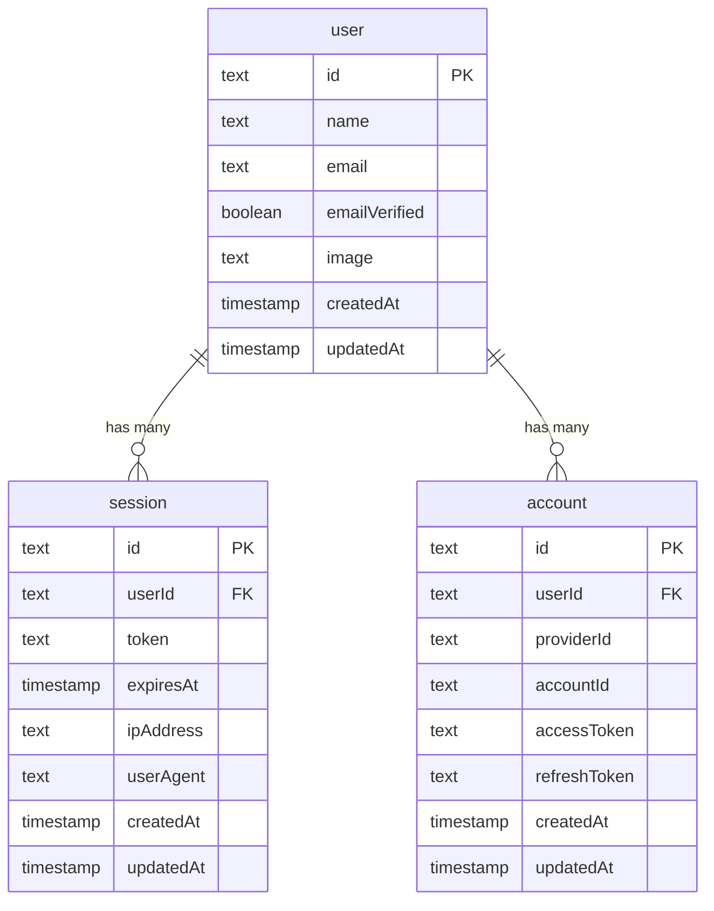

The database schema is defined in `src/db/schema.ts` using Drizzle ORM. All tables are auto-generated by Better Auth to handle authentication, sessions, and OAuth.

## Schema File Location

```
src/db/schema.ts
```

## Better Auth Tables

Better Auth automatically creates and manages five tables for authentication. You don't need to manually create these tables - they're generated when you run `npm run db:push` or `npm run db:migrate`.

### User Table

Stores user account information and profiles.

```ts src/db/schema.ts
export const user = pgTable("user", {
  id: text('id').primaryKey(),
  name: text('name').notNull(),
  email: text('email').notNull().unique(),
  emailVerified: boolean('email_verified').$defaultFn(() => false).notNull(),
  image: text('image'),
  createdAt: timestamp('created_at').$defaultFn(() => new Date()).notNull(),
  updatedAt: timestamp('updated_at').$defaultFn(() => new Date()).notNull()
});
```

**Columns:**

| Column | Type | Constraints | Description |
|--------|------|-------------|-------------|
| `id` | `text` | Primary Key | Unique user identifier |
| `name` | `text` | Not Null | User's display name |
| `email` | `text` | Not Null, Unique | User's email address |
| `emailVerified` | `boolean` | Not Null, Default: `false` | Email verification status |
| `image` | `text` | Nullable | User's profile image URL |
| `createdAt` | `timestamp` | Not Null, Auto | Account creation timestamp |
| `updatedAt` | `timestamp` | Not Null, Auto | Last update timestamp |

### Session Table

Tracks active user sessions with device information.

```ts src/db/schema.ts
export const session = pgTable("session", {
  id: text('id').primaryKey(),
  expiresAt: timestamp('expires_at').notNull(),
  token: text('token').notNull().unique(),
  createdAt: timestamp('created_at').notNull(),
  updatedAt: timestamp('updated_at').notNull(),
  ipAddress: text('ip_address'),
  userAgent: text('user_agent'),
  userId: text('user_id').notNull().references(() => user.id, { onDelete: 'cascade' })
});
```

**Columns:**

| Column | Type | Constraints | Description |
|--------|------|-------------|-------------|
| `id` | `text` | Primary Key | Unique session identifier |
| `expiresAt` | `timestamp` | Not Null | Session expiration time |
| `token` | `text` | Not Null, Unique | Session token |
| `createdAt` | `timestamp` | Not Null | Session creation time |
| `updatedAt` | `timestamp` | Not Null | Last session update |
| `ipAddress` | `text` | Nullable | Client IP address |
| `userAgent` | `text` | Nullable | Client user agent string |
| `userId` | `text` | Foreign Key, Not Null | References `user.id` (cascade delete) |

**Relationships:**
- `userId` → `user.id` (one-to-many: one user can have multiple sessions)
- Cascade delete: deleting a user removes all their sessions

### Account Table

Stores OAuth provider accounts and authentication credentials.

```ts src/db/schema.ts
export const account = pgTable("account", {
  id: text('id').primaryKey(),
  accountId: text('account_id').notNull(),
  providerId: text('provider_id').notNull(),
  userId: text('user_id').notNull().references(() => user.id, { onDelete: 'cascade' }),
  accessToken: text('access_token'),
  refreshToken: text('refresh_token'),
  idToken: text('id_token'),
  accessTokenExpiresAt: timestamp('access_token_expires_at'),
  refreshTokenExpiresAt: timestamp('refresh_token_expires_at'),
  scope: text('scope'),
  password: text('password'),
  createdAt: timestamp('created_at').notNull(),
  updatedAt: timestamp('updated_at').notNull()
});
```

**Columns:**

| Column | Type | Constraints | Description |
|--------|------|-------------|-------------|
| `id` | `text` | Primary Key | Unique account identifier |
| `accountId` | `text` | Not Null | Provider-specific account ID |
| `providerId` | `text` | Not Null | Auth provider (e.g., "google", "credential") |
| `userId` | `text` | Foreign Key, Not Null | References `user.id` (cascade delete) |
| `accessToken` | `text` | Nullable | OAuth access token |
| `refreshToken` | `text` | Nullable | OAuth refresh token |
| `idToken` | `text` | Nullable | OAuth ID token |
| `accessTokenExpiresAt` | `timestamp` | Nullable | Access token expiration |
| `refreshTokenExpiresAt` | `timestamp` | Nullable | Refresh token expiration |
| `scope` | `text` | Nullable | OAuth scope |
| `password` | `text` | Nullable | Hashed password (for credential provider) |
| `createdAt` | `timestamp` | Not Null | Account creation time |
| `updatedAt` | `timestamp` | Not Null | Last update time |

**Relationships:**
- `userId` → `user.id` (one-to-many: one user can have multiple provider accounts)
- Cascade delete: deleting a user removes all their accounts

### Verification Table

Stores email verification tokens and other verification codes.

```ts src/db/schema.ts
export const verification = pgTable("verification", {
  id: text('id').primaryKey(),
  identifier: text('identifier').notNull(),
  value: text('value').notNull(),
  expiresAt: timestamp('expires_at').notNull(),
  createdAt: timestamp('created_at').$defaultFn(() => new Date()),
  updatedAt: timestamp('updated_at').$defaultFn(() => new Date())
});
```

**Columns:**

| Column | Type | Constraints | Description |
|--------|------|-------------|-------------|
| `id` | `text` | Primary Key | Unique verification identifier |
| `identifier` | `text` | Not Null | User identifier (email, phone, etc.) |
| `value` | `text` | Not Null | Verification token/code |
| `expiresAt` | `timestamp` | Not Null | Token expiration time |
| `createdAt` | `timestamp` | Auto | Token creation time |
| `updatedAt` | `timestamp` | Auto | Last update time |

### JWKS Table

Stores JSON Web Key Sets for JWT token verification.

```ts src/db/schema.ts
export const jwks = pgTable("jwks", {
  id: text('id').primaryKey(),
  publicKey: text('public_key').notNull(),
  privateKey: text('private_key').notNull(),
  createdAt: timestamp('created_at').notNull()
});
```

**Columns:**

| Column | Type | Constraints | Description |
|--------|------|-------------|-------------|
| `id` | `text` | Primary Key | Unique key identifier |
| `publicKey` | `text` | Not Null | Public key (for JWT verification) |
| `privateKey` | `text` | Not Null | Private key (for JWT signing) |
| `createdAt` | `timestamp` | Not Null | Key creation timestamp |

<Note>
  The JWKS table is used by Better Auth to issue and verify JWTs. Your backend can fetch public keys from the `/api/auth/jwks` endpoint to verify tokens without sharing secrets.
</Note>

## Schema Relationships

The schema includes the following relationships:



## Type Inference

Drizzle automatically infers TypeScript types from your schema:

```ts
import { user, session, account } from "@/db/schema";
import type { InferSelectModel, InferInsertModel } from "drizzle-orm";

// Select types (what you get from queries)
type User = InferSelectModel<typeof user>;
type Session = InferSelectModel<typeof session>;
type Account = InferSelectModel<typeof account>;

// Insert types (what you need to insert)
type NewUser = InferInsertModel<typeof user>;
type NewSession = InferInsertModel<typeof session>;
type NewAccount = InferInsertModel<typeof account>;
```

## Extending the Schema

To add custom tables to the schema, see the [Adding Tables](/database/adding-tables) guide.

## Next Steps

<CardGroup cols={2}>
  <Card title="Migrations" icon="arrows-rotate" href="/database/migrations">
    Learn how to apply schema changes
  </Card>
  <Card title="Adding Tables" icon="plus" href="/database/adding-tables">
    Add custom tables to your database
  </Card>
</CardGroup>