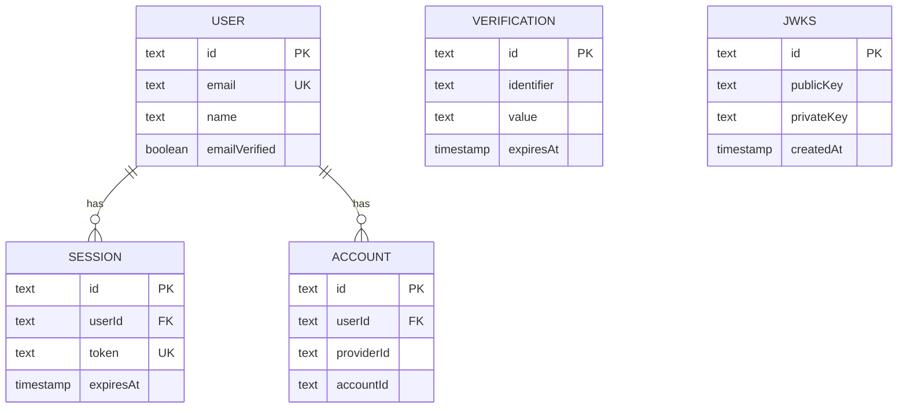

The Auth UI Boilerplate uses PostgreSQL with Drizzle ORM for database management. Better Auth automatically creates and manages five tables for authentication, sessions, OAuth accounts, verification tokens, and JWT keys.

## Schema Overview

All tables are defined in `src/db/schema.ts`:

```typescript src/db/schema.ts
import { pgTable, text, timestamp, boolean } from "drizzle-orm/pg-core";
```

The schema includes:
- **user**: Core user information and profile data
- **session**: Active user sessions with metadata
- **account**: OAuth provider accounts linked to users
- **verification**: Temporary tokens for email verification
- **jwks**: JSON Web Key Set for JWT signing and verification

## Tables

### User Table

Stores core user profile information:

```typescript src/db/schema.ts
export const user = pgTable("user", {
  id: text('id').primaryKey(),
  name: text('name').notNull(),
  email: text('email').notNull().unique(),
  emailVerified: boolean('email_verified').$defaultFn(() => false).notNull(),
  image: text('image'),
  createdAt: timestamp('created_at').$defaultFn(() => new Date()).notNull(),
  updatedAt: timestamp('updated_at').$defaultFn(() => new Date()).notNull()
});
```

| Column | Type | Constraints | Description |
|--------|------|-------------|-------------|
| `id` | text | PRIMARY KEY | Unique user identifier (generated by Better Auth) |
| `name` | text | NOT NULL | User's display name |
| `email` | text | NOT NULL, UNIQUE | User's email address |
| `emailVerified` | boolean | NOT NULL, DEFAULT false | Whether the email has been verified |
| `image` | text | nullable | URL to user's profile picture (from OAuth providers) |
| `createdAt` | timestamp | NOT NULL, DEFAULT NOW | When the user account was created |
| `updatedAt` | timestamp | NOT NULL, DEFAULT NOW | Last time user data was updated |

<Note>
  The `emailVerified` field is automatically set to `true` when users sign in via OAuth providers like Google, since the provider has already verified the email.
</Note>

### Session Table

Tracks active user sessions with security metadata:

```typescript src/db/schema.ts
export const session = pgTable("session", {
  id: text('id').primaryKey(),
  expiresAt: timestamp('expires_at').notNull(),
  token: text('token').notNull().unique(),
  createdAt: timestamp('created_at').notNull(),
  updatedAt: timestamp('updated_at').notNull(),
  ipAddress: text('ip_address'),
  userAgent: text('user_agent'),
  userId: text('user_id').notNull().references(()=> user.id, { onDelete: 'cascade' })
});
```

| Column | Type | Constraints | Description |
|--------|------|-------------|-------------|
| `id` | text | PRIMARY KEY | Unique session identifier |
| `expiresAt` | timestamp | NOT NULL | When the session expires |
| `token` | text | NOT NULL, UNIQUE | Secure session token (stored in HTTP-only cookie) |
| `createdAt` | timestamp | NOT NULL | When the session was created |
| `updatedAt` | timestamp | NOT NULL | Last session activity time |
| `ipAddress` | text | nullable | IP address of the client (for security auditing) |
| `userAgent` | text | nullable | Browser/client user agent (for device tracking) |
| `userId` | text | NOT NULL, FK → user.id | The user this session belongs to |

**Foreign Key:**
- `userId` references `user.id` with `ON DELETE CASCADE` — deleting a user automatically deletes all their sessions

<Tip>
  The `ipAddress` and `userAgent` fields enable security features like detecting suspicious logins from new devices or locations.
</Tip>

### Account Table

Stores OAuth provider accounts linked to users:

```typescript src/db/schema.ts
export const account = pgTable("account", {
  id: text('id').primaryKey(),
  accountId: text('account_id').notNull(),
  providerId: text('provider_id').notNull(),
  userId: text('user_id').notNull().references(()=> user.id, { onDelete: 'cascade' }),
  accessToken: text('access_token'),
  refreshToken: text('refresh_token'),
  idToken: text('id_token'),
  accessTokenExpiresAt: timestamp('access_token_expires_at'),
  refreshTokenExpiresAt: timestamp('refresh_token_expires_at'),
  scope: text('scope'),
  password: text('password'),
  createdAt: timestamp('created_at').notNull(),
  updatedAt: timestamp('updated_at').notNull()
});
```

| Column | Type | Constraints | Description |
|--------|------|-------------|-------------|
| `id` | text | PRIMARY KEY | Unique account identifier |
| `accountId` | text | NOT NULL | Provider-specific account ID (e.g., Google user ID) |
| `providerId` | text | NOT NULL | OAuth provider name (e.g., "google", "github") |
| `userId` | text | NOT NULL, FK → user.id | The user this account belongs to |
| `accessToken` | text | nullable | OAuth access token for API calls |
| `refreshToken` | text | nullable | OAuth refresh token for renewing access |
| `idToken` | text | nullable | OpenID Connect ID token |
| `accessTokenExpiresAt` | timestamp | nullable | When the access token expires |
| `refreshTokenExpiresAt` | timestamp | nullable | When the refresh token expires |
| `scope` | text | nullable | OAuth scopes granted |
| `password` | text | nullable | Hashed password (for email/password accounts) |
| `createdAt` | timestamp | NOT NULL | When the account was linked |
| `updatedAt` | timestamp | NOT NULL | Last time account data was updated |

**Foreign Key:**
- `userId` references `user.id` with `ON DELETE CASCADE` — deleting a user removes all their linked accounts

<Warning>
  OAuth tokens are sensitive credentials. Ensure your database is properly secured with encryption at rest and restricted access.
</Warning>

**Account Types:**

<Tabs>
  <Tab title="OAuth Account">
    When a user signs in with Google:
    
    ```json
    {
      "accountId": "123456789012345678901",
      "providerId": "google",
      "accessToken": "ya29.a0AfH6...",
      "refreshToken": "1//0gW...",
      "idToken": "eyJhbGci...",
      "password": null
    }
    ```
  </Tab>
  
  <Tab title="Email/Password Account">
    When a user signs up with email/password:
    
    ```json
    {
      "accountId": "user@example.com",
      "providerId": "credential",
      "password": "$2b$10$abc123...",
      "accessToken": null,
      "refreshToken": null
    }
    ```
  </Tab>
</Tabs>

### Verification Table

Stores temporary verification tokens for email verification and password resets:

```typescript src/db/schema.ts
export const verification = pgTable("verification", {
  id: text('id').primaryKey(),
  identifier: text('identifier').notNull(),
  value: text('value').notNull(),
  expiresAt: timestamp('expires_at').notNull(),
  createdAt: timestamp('created_at').$defaultFn(() => new Date()),
  updatedAt: timestamp('updated_at').$defaultFn(() => new Date())
});
```

| Column | Type | Constraints | Description |
|--------|------|-------------|-------------|
| `id` | text | PRIMARY KEY | Unique verification identifier |
| `identifier` | text | NOT NULL | What is being verified (email address) |
| `value` | text | NOT NULL | The verification token/code |
| `expiresAt` | timestamp | NOT NULL | When the token expires |
| `createdAt` | timestamp | DEFAULT NOW | When the token was created |
| `updatedAt` | timestamp | DEFAULT NOW | Last update time |

**Use Cases:**
- Email verification when a new user signs up
- Password reset tokens
- Email change confirmations
- Magic link authentication (if enabled)

<Info>
  Tokens are automatically deleted after use or expiration to keep the table clean and secure.
</Info>

### JWKS Table

Stores JSON Web Key Sets for signing and verifying JWT tokens:

```typescript src/db/schema.ts
export const jwks = pgTable("jwks", {
  id: text('id').primaryKey(),
  publicKey: text('public_key').notNull(),
  privateKey: text('private_key').notNull(),
  createdAt: timestamp('created_at').notNull()
});
```

| Column | Type | Constraints | Description |
|--------|------|-------------|-------------|
| `id` | text | PRIMARY KEY | Key identifier (kid in JWT header) |
| `publicKey` | text | NOT NULL | RSA public key for JWT verification |
| `privateKey` | text | NOT NULL | RSA private key for JWT signing |
| `createdAt` | timestamp | NOT NULL | When the key pair was generated |

**Key Management:**
- Better Auth generates RSA key pairs automatically on first use
- The **private key** is used to sign JWTs when users make API requests
- The **public key** is exposed via the `/api/auth/jwks` endpoint for backend verification
- Keys can be rotated for enhanced security

<Warning>
  The private key must be kept secure. Never expose it via APIs or logs. Ensure database backups are encrypted.
</Warning>

## Relationships

Here's how the tables relate to each other:



- A **user** can have multiple **sessions** (e.g., logged in on phone and laptop)
- A **user** can have multiple **accounts** (e.g., linked both Google and email/password)
- **Verification** and **JWKS** tables are independent

## Database Migrations

The boilerplate uses Drizzle ORM for database migrations. To apply the schema:

<Steps>
  <Step title="Generate Migration">
    ```bash
    npm run db:generate
    ```
    
    This creates migration SQL files in the `drizzle` directory.
  </Step>
  
  <Step title="Apply Migration">
    ```bash
    npm run db:migrate
    ```
    
    This runs the migrations against your database.
  </Step>
  
  <Step title="Verify Schema">
    ```bash
    npm run db:studio
    ```
    
    Opens Drizzle Studio to browse your database schema and data.
  </Step>
</Steps>

<Tip>
  Better Auth automatically creates the necessary tables when you first run your application if they don't exist. However, running migrations explicitly is recommended for production deployments.
</Tip>

## Querying the Database

You can query the database using Drizzle ORM:

```typescript
import { db } from "@/db"
import { user, session } from "@/db/schema"
import { eq } from "drizzle-orm"

// Find a user by email
const foundUser = await db
  .select()
  .from(user)
  .where(eq(user.email, "user@example.com"))
  .limit(1)

// Get all sessions for a user
const userSessions = await db
  .select()
  .from(session)
  .where(eq(session.userId, userId))

// Join user and session data
const activeSessions = await db
  .select({
    sessionId: session.id,
    userName: user.name,
    email: user.email,
    ipAddress: session.ipAddress,
  })
  .from(session)
  .innerJoin(user, eq(session.userId, user.id))
  .where(gt(session.expiresAt, new Date()))
```

## Data Retention

<AccordionGroup>
  <Accordion title="Session Cleanup" icon="broom">
    Expired sessions should be periodically cleaned up to prevent database bloat:
    
    ```typescript
    import { db } from "@/db"
    import { session } from "@/db/schema"
    import { lt } from "drizzle-orm"
    
    // Delete expired sessions
    await db
      .delete(session)
      .where(lt(session.expiresAt, new Date()))
    ```
    
    Consider running this as a daily cron job.
  </Accordion>
  
  <Accordion title="Verification Token Cleanup" icon="clock">
    Expired verification tokens are automatically removed by Better Auth after use or expiration.
  </Accordion>
  
  <Accordion title="User Deletion" icon="user-slash">
    When a user is deleted, cascading deletes automatically remove:
    - All user sessions (via `ON DELETE CASCADE`)
    - All linked accounts (via `ON DELETE CASCADE`)
    
    This ensures no orphaned data remains in the database.
  </Accordion>
</AccordionGroup>

## Security Best Practices

<CardGroup cols={2}>
  <Card title="Encryption at Rest" icon="lock">
    Enable PostgreSQL encryption for sensitive fields like passwords and OAuth tokens.
  </Card>
  
  <Card title="Access Control" icon="user-shield">
    Restrict database access to only the application server. Use strong passwords and firewall rules.
  </Card>
  
  <Card title="Regular Backups" icon="floppy-disk">
    Implement automated, encrypted backups with point-in-time recovery.
  </Card>
  
  <Card title="Audit Logging" icon="clipboard-list">
    Enable PostgreSQL audit logging to track access to sensitive tables.
  </Card>
</CardGroup>

## Next Steps

<CardGroup cols={2}>
  <Card title="Authentication" icon="lock" href="/features/authentication">
    Learn how Better Auth uses these tables for authentication
  </Card>
  
  <Card title="JWT Tokens" icon="key" href="/features/jwt-tokens">
    Understand how the JWKS table enables JWT signing
  </Card>
</CardGroup>